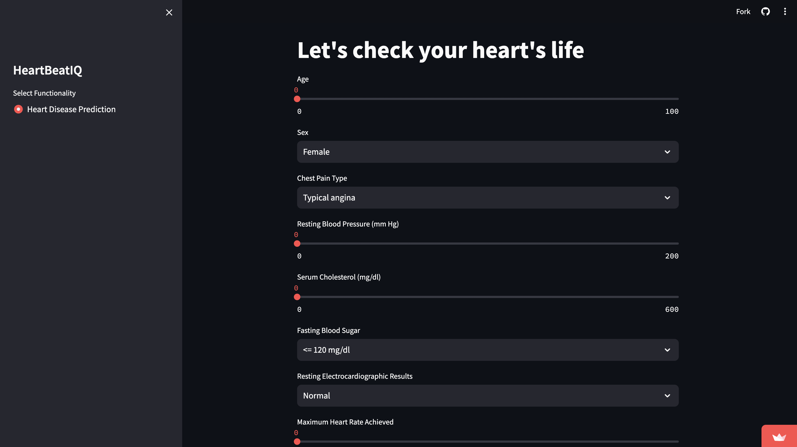
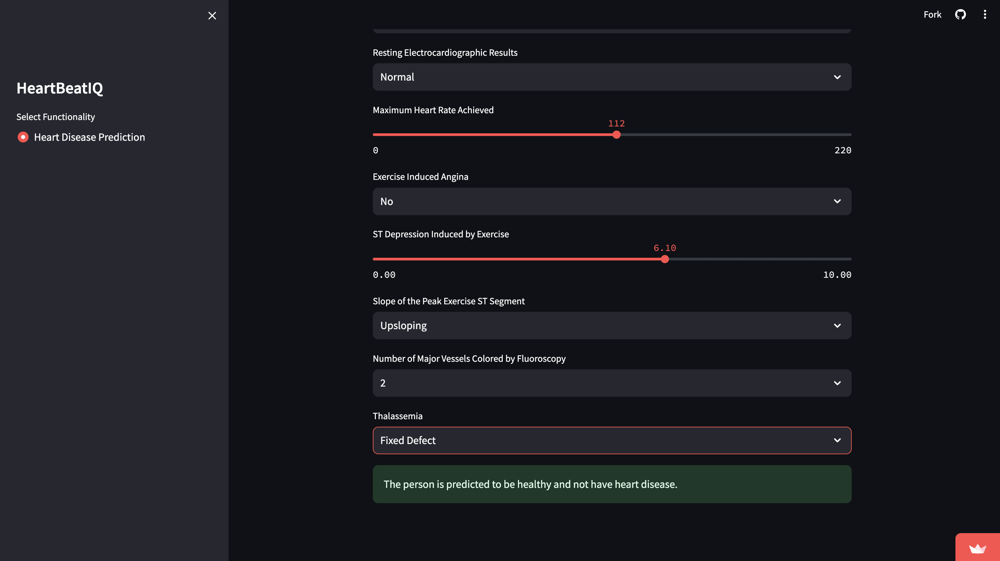
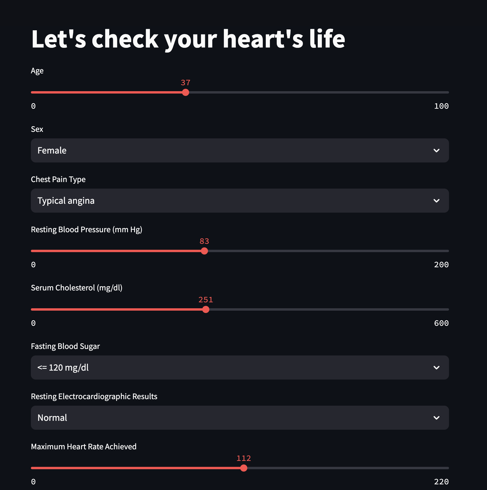
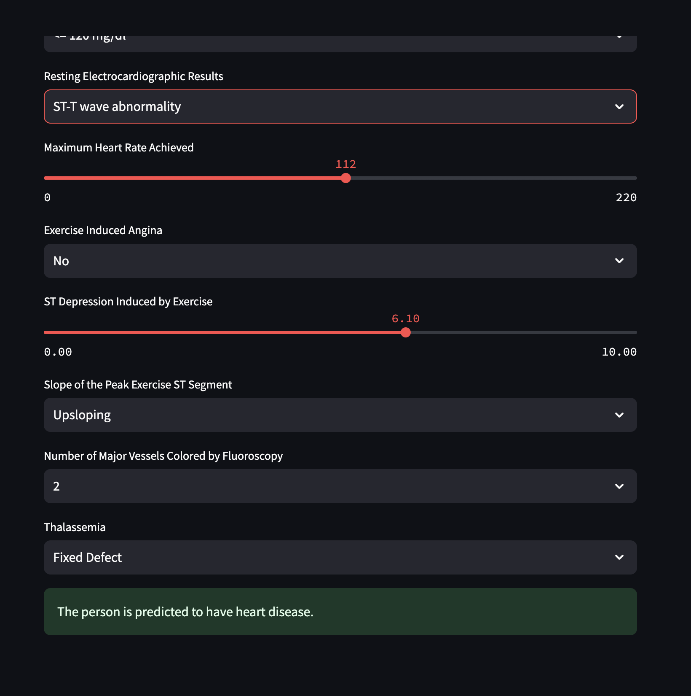

# HeartbeatIQ

## Project Overview

**HeartbeatIQ** HeartbeatIQ is a collaborative team project focused on developing and deploying a machine learning model aimed at predicting
heart disease with higher accuracy. The primary goal of the project is to leverage advanced machine learning techniques to enhance early detection of heart disease, thereby improving patient care standards through innovative, data-driven approaches.

### Key Technologies Used:
- **Programming Language:** Python
- **Machine Learning Libraries:** scikit-learn, TensorFlow
- **Visualization Tools:** Matplotlib, Seaborn


## Table of Contents

1. [Installation](#installation)
2. [Usage](#usage)
3. [Dataset Information](#dataset-information)
4. [Model Performance](#model-performance)
5. [Exploratory Data Analysis Findings](#exploratory-data-analysis-findings)
6. [Screenshots](#screenshots)
7. [Impact](#impact)

## Installation

### Prerequisites

- Python 3.8 or higher
- Pip package manager
- Virtual environment (optional but recommended)

### Steps

1. **Clone the repository**

    ```bash
    git clone https://github.com/aansh06/heartbeatIQ.git
    cd heartbeatIQ
    ```

2. **Create a virtual environment (optional but recommended)**

    ```bash
    python -m venv venv
    source venv/bin/activate  # On Windows use `venv\Scripts\activate`
    ```

3. **Install the dependencies**

    ```bash
    pip install -r requirements.txt
    ```

## Usage

1. **Starting the Application**

    ```bash
    streamlit run app.py
    ```

2. **Accessing the Dashboard**

    Open your web browser and go to the URL provided by Streamlit to access the HeartbeatIQ dashboard.


## Dataset Information

The dataset used for analysis in HeartbeatIQ is sourced from Kaggle and includes various health parameters related to cardiovascular health:

- **_cp**: Chest pain type (0: Typical angina, 1: Atypical angina, 2: Non-anginal pain, 3: Asymptomatic)
- **_trestbps**: Resting blood pressure (in mm Hg) upon hospital admission
- **_chol**: Serum cholesterol level (in mg/dl)
- **_fbs**: Fasting blood sugar level (> 120 mg/dl is 1, otherwise 0)
- **_restecg**: Resting electrocardiographic results (0: Normal, 1: ST-T wave abnormality, 2: Probable/definite left ventricular hypertrophy)
- **_thalach**: Maximum heart rate achieved
- **_exang**: Exercise-induced angina (1: yes, 0: no)
- **_oldpeak**: ST depression induced by exercise relative to rest
- **_slope**: Slope of the peak exercise ST segment (0: Upsloping, 1: Flat, 2: Downsloping)
- **_ca**: Number of major vessels (0-3) colored by fluoroscopy
- **_thal**: Thalassemia (1: Normal, 2: Fixed defect, 3: Reversible defect)

## Model Performance

HeartbeatIQ leverages several machine learning algorithms for analysis, achieving the following accuracy scores:

- **Logistic Regression**: %
- **Naive Bayes**: %
- **Support Vector Machine**: %
- **K-Nearest Neighbors**: %
- **Decision Tree**: %
- **Random Forest**: %
- **XGBoost**: %
- **Neural Network**: %

## Exploratory Data Analysis Findings

Based on the dataset exploration and analysis, here are some key findings:

- The minimum age to have heart disease starts from 28 years old.
- Most people get heart disease at the age of 53 to 54 years.
- The age range with the highest heart disease incidence for both males and females is 54 to 55 years.
- Male percentage in the data: 78.91%, Female percentage: 21.09%.
- Males are 274.23% more than females in the data.
- The highest number of people are from Cleveland (304), the lowest from Switzerland (123).

### Age vs. Sex and Origin

- The highest number of females in this dataset are from Cleveland (97) and the lowest from VA Long Beach (6).
- The highest number of males are from Hungary (212) and the lowest from Switzerland (113).

### Chest Pain according to Origins

- Typical angina, asymptomatic, and non-anginal chest pain are most common in Cleveland, while atypical angina is highly prevalent in Hungary.
- The lowest incidence of chest pain (all types) is in Switzerland compared to other origins.

### Chest Pain according to Age

- Asymptomatic angina is the most common chest pain type.
- Typical angina is most frequent at ages 62-63.
- Asymptomatic angina peaks at ages 56-57.
- Non-anginal pain peaks at ages 54-55.
- Atypical angina peaks at ages 54-55.

## Screenshots

### Main Dashboard






## Impact
The HeartbeatIQ project aims to set a new standard in the early detection of heart disease by combining the power of machine learning with medical expertise. By doing so, the project not only advances the field of medical diagnostics but also holds the promise of significantly improving patient care and outcomes through timely and accurate detection of heart conditions.


